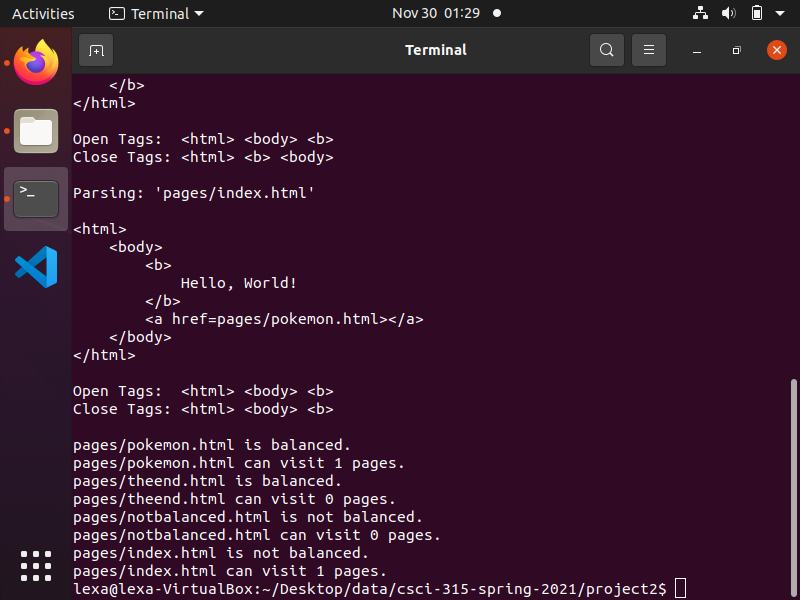

Portfolio
=========

Programming Projects
--------------------

*For access to my private project repositories, please [email me](mailto:LJMosby@csustudent.net?subject=GitHub%20Access) with the subject line, GitHub Access.

---
### [Guessing Game Project | CSCI 301](projects/Project1)

---
### [HTML Parser Project | CSCI 315](projects/Project2)

---
### [Test Prep Driver Project | CSCI 325](projects/Project3)

---

Ethics Papers
-------------

### [THERAC-25 Ethics Paper](/pdf/Data%20Structures%20THERAC25%20Ethics%20Paper.docx)

-   **Class:**  Data Structures
-   **Grade:** B

### [Software Licensing Ethics Paper](/pdf/Operating%20Systems%20Ethics%20Paper.docx)

-   **Class:** Operating Systems
-   **Grade:** B

### [Privacy and Anonymity Ethics Paper](/pdf/Operating%20Systems%20Ethics%20Paper.docx)

-   **Class:** Algorithms
-   **Grade:** TBD

---

Presentations
-------------

### [Raes Riding Lessons Website Training Video Presentation](https://www.youtube.com/watch?v=JoLWhlogG9Y)

- **Class:** Systems Analysis and Design
- **Grade:** B

### [Charity Website Group Project Presentation](https://www.youtube.com/watch?v=cwbWQWs2Ucc)

- **Class:** User-Interface Programming
- **Grade:** B

---

Page template forked from <a href="https://github.com/csu-cs/csci-portfolio">CSU-CS</a>

<!-- Remove above link if you don't want to attributive -->
