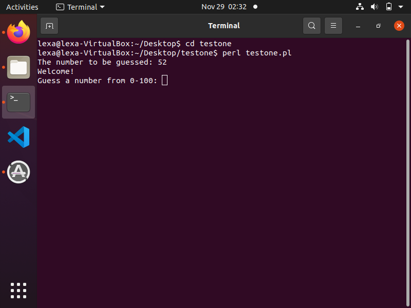
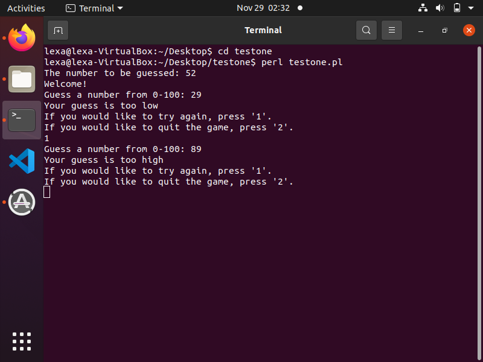
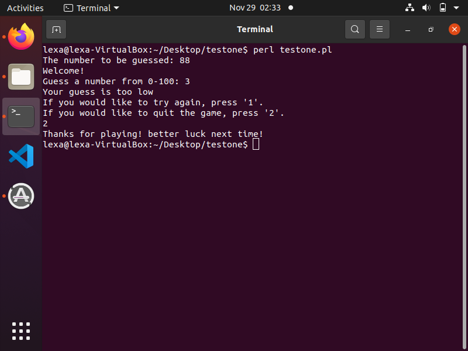

[Back to Portfolio](../../../)

Scripting Language Project
===============

-   **Class:** Survey of Scripting Languages
-   **Grade:** A
-   **Language(s):** Perl
-   **Source Code Repository:** [Test one project](https://github.com/LexaMO/Portfolio-Project-1)  
    (Please [email me](mailto:LJMosby@csustudent.net?subject=GitHub%20Access) to request access.)

## Project description

Perl program that simulates guessing game. Program will randomly assign a number to be guessed. User will enter random guess and program will display whether the guess is less than, greater than, or equal to randomized number. Program will also give option for user to continue guessing or quit the game in between guesses.

## How to compiles / run the program

How to compile (if applicable) and run the project.

```bash
cd ./Project1
perl testone.pl
```

## UI Design

Program will display the number to be guessed and ask you to guess a number (See Fig 1.). Depending on your input, the program will output whether your guess is too high or low (See Fig. 2). The program will continue to let you guess as long as you choose number 1 when it displays the option between every guess, and the program will terminate if you choose 2 when it gives you the option to quit after a guess (see Fig. 3). 


Fig 1. The launch screen


Fig 2. Example output after input is processed.


Fig 3. Feedback when game is over.


## 3. Additional Considerations
Program displays randomized number to be guessed for testing purposes.
Program also does not account for wrong input from user.


[Back to Portfolio](../../../)
