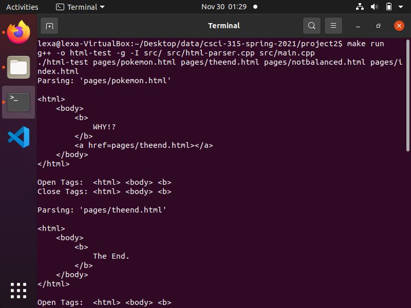

[Back to Portfolio](../../../)

HTML Parser Project
===============

-   **Class:** Data Structures
-   **Grade:** c
-   **Language(s):** c++
-   **Source Code Repository:** [html project src code](https://github.com/LexaMO/ProjectsPortfolio/tree/master/Project2)  
    (Please [email me](mailto:LJMosby@csustudent.net?subject=GitHub%20Access) to request access.)

## Project description
A program that determines if the html tags in a file are balanced and finds the number of pages that can be visited from a certain html page.
 
## How to compiles / run the program

How to compile (if applicable) and run the project.

```bash
cd ./Project2
make
make run
```

## UI Design

Program is designed to scan files and output the contents of each file for testing purposes(see Fig 1.). Program will then display whether they are balanced and how many pages you can visit from that page (see Fig 2.).


Fig 1. start of program run that displays the contents of each file


Fig 3. The end of program displays results of tests.


## 3. Additional Considerations

 


[Back to Portfolio](../../../)
