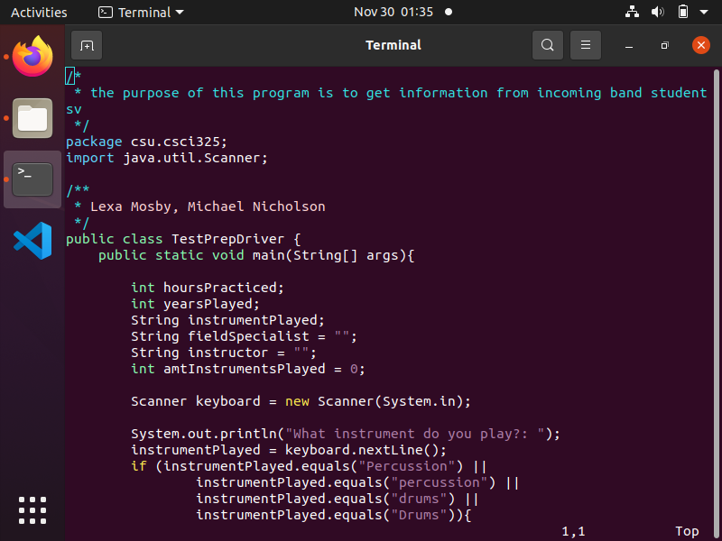
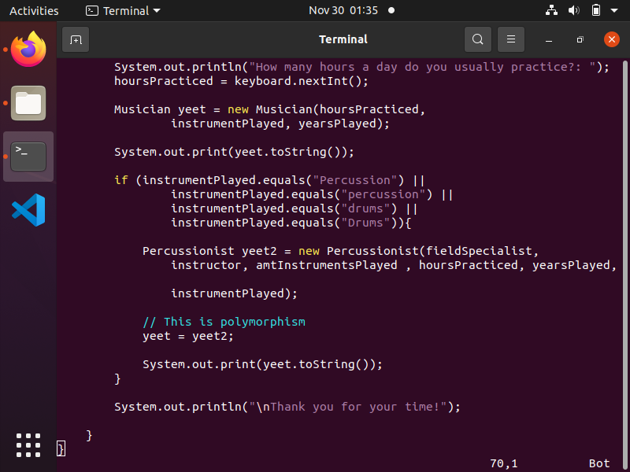

[Back to Portfolio](../../../)

Test Prep Driver Project
===============

-   **Class:** Object Oriented Programming
-   **Grade:** Unknown
-   **Language(s):** Java
-   **Source Code Repository:** [Test Prep Driver](https://github.com/LexaMO/ProjectsPortfolio/tree/master/Project3)  
    (Please [email me](mailto:LJMosby@csustudent.net?subject=GitHub%20Access) to request access.)

## Project description


## How to compiles / run the program

How to compile (if applicable) and run the project.

```bash
cd ./Project3
java TestPrepDriver.java
```

## UI Design
Program is designed to emulate a form that gathers information from band students and demonstrate an object and class relationship.
The TestPrepDriver file (see Fig. 1 and 2) is meant to take from the other two files and their respective functions.


Fig 1. The beginning of Test Prep file


Fig 2. Bottom of Test Prep file

## 3. Additional Considerations

Contribution Credits: Michael Nicholson

Program is not running based on issues in Test Prep Driver Function


[Back to Portfolio](../../../)
